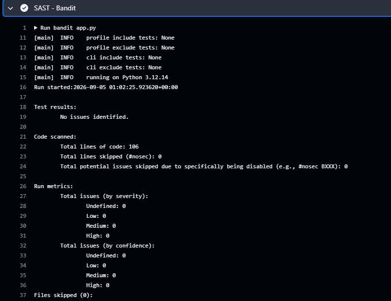
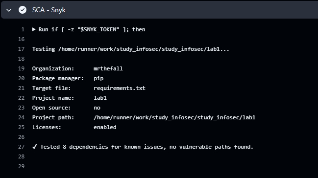

# Лабораторная работа № 1

## Разработка защищённого REST API с интеграцией в CI/CD

## Запуск

```bash
python3 -m pip install -r requirements.txt
python3 -m flask --app app run
```

База `data.db` создаётся автоматически при первом запуске.
Логин: `test`, пароль: `password`.

## Эндпоинты API

### Аутентификация

**POST /auth/login - Аутентификация пользователя**

```bash
curl -X POST http://127.0.0.1:5000/auth/login \
  -H "Content-Type: application/json" \
  -d '{"username":"test","password":"password"}'
```

Возвращает JWT в поле `access_token`. Его значение нужно вставить
вместо `<JWT_TOKEN>` в следующих запросах.

### Защищённые эндпоинты (требуют JWT)

**GET /api/data - Получение своих заметок**

```bash
curl -X GET http://127.0.0.1:5000/api/data \
  -H "Authorization: Bearer <JWT_TOKEN>"
```

Возвращает список заметок с полями `id` и `text`. Код ответа: `200`.

**POST /api/data - Создание заметки**

```bash
curl -X POST http://127.0.0.1:5000/api/data \
  -H "Authorization: Bearer <JWT_TOKEN>" \
  -H "Content-Type: application/json" \
  -d '{"text":"Моя первая заметка"}'
```

Возвращает созданную заметку. Код ответа: `201`.
Текст должен содержать от 1 до 1000 символов и не состоять только из пробелов.
Без JWT оба эндпоинта возвращают `401`, при некорректных данных - `400`.

## Postman

[Коллекция запросов](lab1.postman_collection.json).

После запроса входа JWT автоматически сохраняется в переменную `token`
и подставляется в защищённые запросы.

## Реализованные меры защиты

### Защита от SQL Injection (SQLi)

**Технология:** SQLite, параметризованные запросы.

**Реализация:** SQL и пользовательские данные передаются отдельно.
Вместо подстановки строк используются параметры `?`.

**Код:**

```python
user = get_db().execute(
    "SELECT id, password_hash FROM users WHERE username = ?", (username,)
).fetchone()
```

```python
cursor = db.execute(
    "INSERT INTO notes (user_id, text) VALUES (?, ?)", (g.user_id, text)
)
```

### Защита от XSS (Cross-Site Scripting)

**Технология:** `markupsafe.escape()`.

**Реализация:** текст заметок экранируется перед возвратом при создании
и чтении. Например, `<script>` превращается в `&lt;script&gt;`.
Ответы возвращаются в формате JSON.

**Код:**

```python
return jsonify(id=cursor.lastrowid, text=str(escape(text))), 201
```

```python
return jsonify([{"id": row["id"], "text": str(escape(row["text"]))} for row in rows])
```

### Аутентификация

**Технология:** JWT (PyJWT) + scrypt (Werkzeug).

**Реализация:**

Пароли хэшируются алгоритмом scrypt со случайной солью.
В базе хранится только хэш.

```python
generate_password_hash("password", method="scrypt")
```

При входе пароль проверяется по хэшу:

```python
check_password_hash(user["password_hash"], password)
```

JWT содержит идентификатор пользователя `sub` и срок действия `exp` - один час:

```python
token = jwt.encode(
    {"sub": str(user["id"]), "exp": datetime.now(timezone.utc) + timedelta(hours=1)},
    app.config["SECRET_KEY"],
    algorithm="HS256",
)
```

Декоратор `login_required` проверяет подпись, срок действия JWT и наличие
пользователя в базе. Разрешён только алгоритм `HS256`.

```python
payload = jwt.decode(
    parts[1],
    app.config["SECRET_KEY"],
    algorithms=["HS256"],
    options={"require": ["sub", "exp"]},
)
```

Декоратор установлен на обоих защищённых эндпоинтах:

```python
@app.get("/api/data")
@login_required
def get_data():
    ...

@app.post("/api/data")
@login_required
def create_data():
    ...
```

Пользователь получает только свои заметки: запрос к базе содержит
условие `WHERE user_id = ?` с идентификатором из проверенного JWT.

Секрет подписи случайно генерируется при каждом запуске приложения:

```python
app.config["SECRET_KEY"] = secrets.token_hex(32)
```

После перезапуска нужно войти заново, так как старые токены становятся
недействительными. Файл базы исключён из Git через `.gitignore`.

## CI/CD и сканеры

[Конфигурация GitHub Actions](../.github/workflows/ci.yml).
Проверки запускаются при каждом `push` и `pull_request`.

- SAST: Bandit проверяет `app.py`.
- SCA: Snyk проверяет зависимости из `requirements.txt`.
- Результаты сканирования выводятся в лог раннера.
- Найденные уязвимости приводят к ошибке pipeline.

Локальный запуск сканеров:

```bash
python3 -m pip install -r requirements-dev.txt
python3 -m bandit app.py
snyk test --file=requirements.txt --package-manager=pip --command=python3
```

## Результаты проверки

Локально выполнены HTTP-запросы через Postman:

| Проверка | Результат |
| --- | --- |
| GET и POST `/api/data` без токена | `401` |
| Вход с правильным паролем | `200`, выдан JWT |
| Создание заметки с JWT | `201` |
| Получение заметок с JWT | `200` |
| SQL-инъекция при входе | `401` |
| XSS в тексте заметки | HTML-символы экранированы |
| SAST: Bandit | 0 замечаний |
| SCA: Snyk | Проверены 8 зависимостей, уязвимости не найдены |

## Скриншоты

### Отчет шага SAST



### Отчет шага SCA


